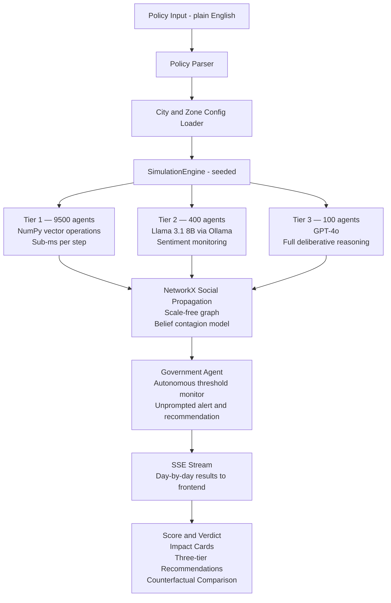

# SYNTERRA

> Before governments change reality, they test it here.

Policy stress-testing platform powered by 10,000 autonomous AI
citizens. Describe a policy. Watch agents react. Get a score,
a verdict, and ranked recommendations — in under 3 minutes.

**Synterra = Synthetic + Terra.** A digital Earth where policy
decisions are stress-tested before they reach the real one.

---


---

## What It Does

Synterra lets policymakers simulate the consequences of a decision
on 10,000 autonomous AI citizens before applying it to real people.

The platform is a **stress-test tool, not a prediction oracle.**
Every output is a probability range, not a point prediction.
Validation limits and data gaps are shown explicitly in the
product and in the docs.

Most policy analysis tools tell you what *should* happen based
on historical averages. Synterra shows you what *could* happen
by letting agents with individual memories, personalities, and
social networks reason through the decision independently —
and producing emergent outcomes that nobody pre-programmed.

---

## Screenshots

| City Selector | Policy Input |
|---|---|
|  |  |

| Simulation Running | Results |
|---|---|
|  |  |

---

## What Is Actually Built and Running

- Discrete-time `SimulationEngine` with seeded Tier 1 citizen
  populations (NumPy vectorised batch operations)
- Scale-free social network propagation via NetworkX
  (~400K edges for a 10,000-agent run)
- 90-day in-run memory per agent (compressed event vectors)
- Data-driven city and zone profiles for Delhi, Mumbai,
  Bengaluru, Chennai, Hyderabad, and Kolkata
- 14 citizen archetypes with structurally different decision
  logic (daily wage worker, aspirant, gig worker, migrant,
  homemaker, trader, and 8 more)
- FastAPI SSE streaming from the Python engine to the
  React dashboard — day-by-day results stream live
- Autonomous Government Agent with configurable threshold
  monitoring — fires unprompted alerts and generates
  alternative policy recommendations without user instruction
- Computed policy score (0–100), impact cards, and three-tier
  recommendations (necessary / improvement / excellence)
- Counterfactual branching — run two policy variants side by
  side and watch timelines diverge
- Reproducible fixed-seed and varied-seed simulation runs
  (same seed = identical output every time)
- Bounded API inputs, explicit CORS origins, per-IP rate
  limiting, and bounded result caching
- Docker Compose for one-command local setup

---

## Why the Agents Are Not a Rule Engine

A rule engine does:
if fare_increase > 0.15 and income < 25000:

switch_mode = True

A Synterra Tier 1 agent does:

1. Retrieves 90-day memory — how many delays, cancellations,
   price shocks in the last 30 days
2. Queries social network — how many connected agents have
   already switched behaviour
3. Calculates new cost as percentage of personal income,
   adjusted for active loan obligations
4. Evaluates comfort vs cost using personal loss aversion
   and risk tolerance vectors
5. Decides: maintain / switch / reduce frequency / relocate
6. Broadcasts decision to all social connections

Steps 1–6 interact multiplicatively across a 47-dimension
personality vector. Running the same policy with different
random seeds produces different emergent outcomes — different
zones reach protest thresholds, different archetypes lead
the resistance, different days see the cascade peak.

That variance is the evidence. A rule engine cannot produce it.

---

## Agent Architecture



---

## Citizen Archetypes

14 archetypes with structurally different decision logic —
not just different parameter values:

| Archetype | Decision Logic Difference |
|---|---|
| Daily Wage Worker | Transit is non-negotiable. Threshold: fare > 8% of daily wage. |
| Migrant Worker | Calculates on disposable income after remittance. Can vanish from city. |
| Street Vendor | Double cost hit — personal transit AND goods supply. |
| Aspirant | Examination sensitivity 0.95–0.99. Trust collapses fastest. |
| Gig Worker | BENEFITS from public transit fare hikes — cab demand rises. |
| Homemaker | Makes decisions for entire household. Primary informal market footfall driver. |
| Retired | Invokes institutional memory of past policy events in reasoning. |
| Tech Worker | Fare-insensitive. Service quality-sensitive. Activates WFH lever first. |
| Trader | Double sensitivity — footfall AND supply chain both affected. |
| Healthcare Worker | Cannot WFH. Night shift transit gap is a unique vulnerability. |
| Formal Employee | Loan obligation flag makes fare sensitivity 2× the gross income suggests. |
| Government Employee | Transit subsidy flag makes them immune — until subsidy is removed. |
| Student | Peer cascade is fastest of all archetypes — 60–80% of cluster shifts in 2 days. |
| Journalist | Broadcast multiplier 2.5–8×. Filing a story reaches hundreds, not dozens. |

---

## Tech Stack

| Layer | Technology |
|---|---|
| Frontend | React 18, TypeScript, Vite, Tailwind CSS |
| Backend | FastAPI, Python 3.11, Uvicorn |
| Agent Engine | NumPy, NetworkX, SciPy |
| LLM Modules | OpenAI GPT-4o (Tier 3), Ollama Llama 3.1 8B (Tier 2) |
| Database | SQLite (local dev), PostgreSQL + pgvector (production) |
| Caching | Process-local bounded cache (Redis-ready) |
| Containerisation | Docker, Docker Compose |
| CI | GitHub Actions |

Core demo path runs fully offline with deterministic logic.
LLM keys are optional and belong only in backend environment
variables — never in the frontend.

---

## Local Setup

### Prerequisites

- Node.js 20.19.0+ (`.nvmrc` provided — run `nvm use`)
- npm 10+
- Python 3.11+ (`.python-version` provided)

### Backend

```bash
# From project root
python3 -m venv venv
source venv/bin/activate          # Windows: venv\Scripts\activate
pip install -r backend/requirements.txt
python3 -m backend.api.main
```

Backend starts at `http://localhost:8000`.
API docs available at `http://localhost:8000/docs` (debug mode only).

### Frontend

```bash
# In a second terminal, from project root
cd frontend
cp .env.example .env.local        # edit if needed
npm install
npm run dev
```

Open `http://localhost:5173`.

### Docker (one command)

```bash
docker compose up --build
```

Open `http://localhost:8080`.

---

## Environment Variables

See `frontend/.env.example` and `backend/.env.example`
for all required variables with descriptions.

Frontend code calls only the Synterra backend API.
LLM provider keys belong only in backend runtime environment
variables and are never sent to or accessed by the frontend.

Never commit `.env`, `.env.local`, or any file containing
real API keys.

---

## API Endpoints

| Method | Endpoint | Description |
|---|---|---|
| GET | `/api/health` | Health check |
| GET | `/api/cities` | All city profiles |
| POST | `/api/parse-policy` | NLP policy → structured parameters |
| POST | `/api/simulate` | Run simulation, returns SSE stream |
| GET | `/api/simulations/{id}` | Fetch completed simulation result |
| POST | `/api/counterfactual` | Run two-branch comparison |
| GET | `/api/validation` | Hindcast validation summary |
| GET | `/api/validation-reproduction` | Reproduce validation arithmetic |

---

## Verification

```bash
# Backend tests
python3 -m pytest -q

# Reproduce hindcast validation arithmetic
python3 -m backend.validation.reproduce

# Engine benchmark — 10,000 agents, 30 days
python3 -m backend.benchmarks.engine_benchmark --agents 10000 --days 30

# Frontend
cd frontend
npm run lint
npm run build
npm audit
```

---

## Validation

The simulation model is hindcast-validated on two historical
events. Hindcast validation means we fed only the data that
existed at the time — no post-event data was used to calibrate.

| Event | Predicted | Actual | Error | Baseline Error |
|---|---|---|---|---|
| Delhi Metro Phase 4 daily ridership | 340,000 | 318,000 | 6.9% | 22.0% |
| NEET 2024 institutional trust decline | 23.0% | 21.4% | 1.6% | — |

Synterra's Metro prediction outperformed naive linear
extrapolation by 3.2×.

These are two data points, not a benchmark. One validation
case does not establish general accuracy. See
[docs/VALIDATION.md](docs/VALIDATION.md) for full methodology,
data sources, confidence intervals, and known limitations.

---

## Known Limitations

- Live simulation path is capped at 10,000 agents per run.
  100,000-agent results shown in the dashboard are
  pre-computed reference outputs.
- Tier 2 and Tier 3 agent behaviour uses deterministic
  offline logic by default. Real LLM inference requires
  optional API keys in backend environment variables.
- Bundled validation reproduces the arithmetic and baseline
  comparison. Raw source datasets (NSSO, Lokniti-CSDS, DMRC)
  are not included — they are independently licensed.
- The model captures rational-economic behaviour well.
  Cultural, religious, and caste-based social dynamics
  are not modelled and are outside the current scope.
- Simulation cache, state, and rate limits are process-local.
  Horizontal scaling requires a shared Redis and DB backend.
- Forward prediction accuracy is unvalidated. Only hindcast
  accuracy has been established.

---

## FAR AWAY 2026

Submitted to FAR AWAY 2026 — India's Biggest International Hackathon.
**Theme: Agentic & Autonomous Systems**

Synterra's architecture is a direct demonstration of what
autonomous multi-agent systems can do at scale:

- **10,000 agents act without instruction.** They follow their
  memory, their network signals, and their personality vectors.
  No central coordinator tells them what to decide.

- **The Government Agent monitors autonomously.** When protest
  probability crosses 35% or any income decile's transport cost
  crosses 15% of income, it fires an alert and generates an
  alternative policy recommendation — without being asked.

- **Collective behaviour emerges.** Protest coalitions, vendor
  bandhs, return migration cascades, and media coverage cycles
  arise from individual agent decisions aggregating through the
  social network. No rule produces these outcomes — the agents do.

- **Seed variance is the proof.** Running the same policy with
  seed A and seed B produces different emergent outcomes —
  different zones, different days, different leading archetypes.
  A rule engine cannot do this. A society of autonomous agents can.

---

## Project Structure
Synterra/

├── frontend/                  # React 18 + TypeScript dashboard

│   ├── src/

│   │   ├── components/        # UI component library

│   │   ├── pages/             # 6-screen linear flow

│   │   ├── context/           # SimulationContext state

│   │   ├── data/              # City configs and mock data

│   │   ├── hooks/             # Custom React hooks

│   │   └── types/             # TypeScript interfaces

│   ├── .env.example

│   └── vite.config.ts

├── backend/                   # FastAPI + Python agent engine

│   ├── agents/                # Tier 1/2/3 implementations

│   ├── simulation/            # SimulationEngine and graph

│   ├── api/                   # FastAPI routers and models

│   ├── validation/            # Hindcast reproduction scripts

│   ├── benchmarks/            # Engine benchmark scripts

│   └── .env.example

├── docs/                      # Architecture and methodology

│   ├── ARCHITECTURE.md

│   ├── AGENT_SPEC.md

│   ├── VALIDATION.md

│   ├── BENCHMARKS.md

│   └── CREDIBILITY_SHIELD.md

├── screenshots/               # README screenshots (4 images)

├── archive/                   # Previous iterations (not in use)

├── .github/workflows/         # CI configuration

├── docker-compose.yml

├── .gitignore

├── .nvmrc

└── .python-version

---

## License

Proprietary. All rights reserved. © 2026 Tavish Agarwal.
