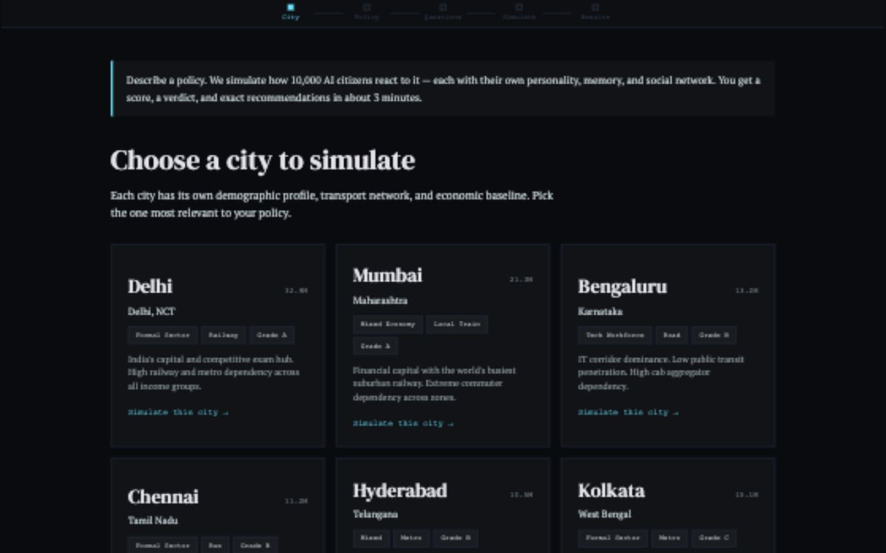
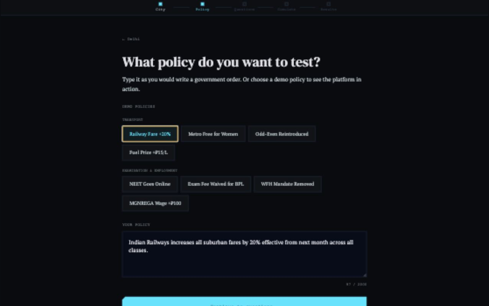
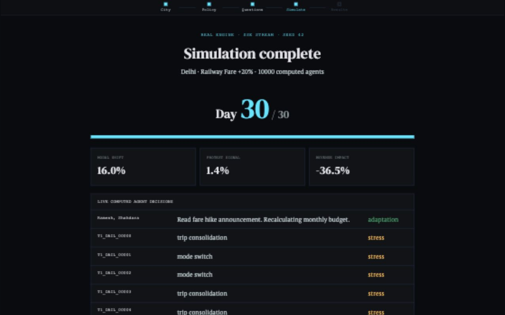
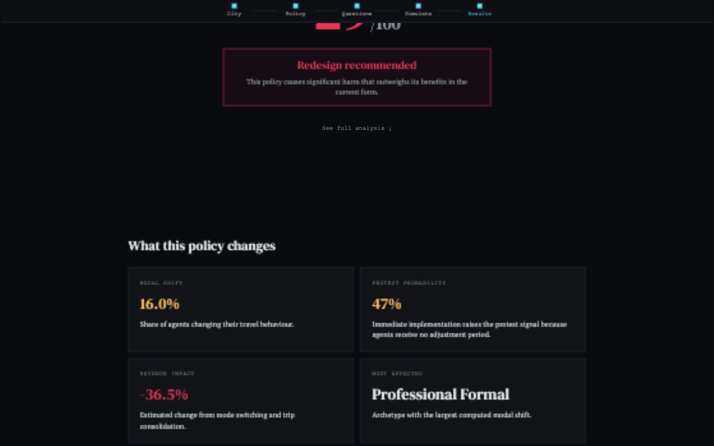

# SYNTERRA

> Policy stress-testing platform powered by 10,000 autonomous AI citizens.
> Test government decisions before real people pay for them.



## What It Does

Synterra lets policymakers stress-test a decision on a simulated city
before applying it to real people.

Pick a city, describe a policy, answer a few implementation questions, then
watch a seeded Python simulation stream agent decisions, alerts, scores, and
recommendations into a React dashboard.

This is a stress-test tool, not a prediction oracle. Validation limits and data
gaps are shown explicitly in the product and docs.

## Screenshots

| City Selector | Policy Input |
|---|---|
|  |  |

| Simulation Running | Results |
|---|---|
|  |  |

## What Runs Today

- Real discrete-time `SimulationEngine` with seeded Tier 1 citizen populations
- Data-driven profiles for Delhi, Mumbai, Bengaluru, Chennai, Hyderabad, and Kolkata
- Scale-free social-network propagation and 90-day in-run memory
- FastAPI SSE streaming from the Python engine to the frontend
- Autonomous Government Agent threshold monitoring
- Computed policy score, impact cards, and three-tier recommendations
- Reproducible fixed-seed and varied-seed tests
- Bounded API inputs, explicit CORS origins, rate limiting, and bounded caching

## Tech Stack

| Layer | Technology |
|---|---|
| Frontend | React, TypeScript, Vite |
| Backend | FastAPI, Python 3.11 |
| Agent Engine | NumPy, NetworkX, SciPy |
| LLM Modules | Optional OpenAI/Ollama-backed agents; core demo runs offline |
| Validation | Reproducible hindcast arithmetic scripts |

## Local Setup

### Prerequisites

- Node.js 20.19.0+ (`nvm use` reads `.nvmrc`)
- npm 10+
- Python 3.11+

### ⚠️ Running the Premium Version (Correct Branch)
The main development containing the premium force-directed social graph, SQLite database, and advanced simulation visualizer lives on the `pulkit-improvements` branch. 

If you or your friends clone this repository, Git will default to the legacy retro screen on the `main` branch. To run the premium dashboard:
```bash
git checkout pulkit-improvements
```

To update the default `main` branch on GitHub so it always shows the new premium screens by default:
```bash
# Switch to main and merge the improvements
git checkout main
git merge pulkit-improvements

# Push updated main to GitHub
git push origin main
```

### Step-by-Step Instructions

#### 1. Setup and Start the Backend

Open a terminal at the project root folder.

**On macOS / Linux:**
```bash
# Create virtual environment
python3 -m venv venv
source venv/bin/activate

# Install dependencies
pip install -r backend/requirements.txt

# Start backend server
python3 -m backend.api.main
```

**On Windows:**
```powershell
# Create virtual environment
python -m venv venv
.\venv\Scripts\activate

# Install dependencies
pip install -r backend/requirements.txt

# Start backend server
python -m backend.api.main
```

The backend server will start at `http://localhost:8000`.

#### 2. Setup and Start the Frontend

Open a second terminal at the project root folder.

```bash
# Navigate to the frontend directory
cd frontend

# Install packages
npm install

# Start Vite dev server
npm run dev
```

Open `http://localhost:5173` in your browser.

For local development without real LLM keys, leave the key values as placeholders.
The central demo path uses deterministic offline logic.

### Containerized Run

```bash
docker compose up --build
```

Open `http://localhost:8080`.

## Environment Variables

See `frontend/.env.example` and `backend/.env.example` for all required values.
Never commit `.env`, `.env.local`, or provider API keys.

Frontend code calls only the Synterra backend. LLM provider keys belong
only in backend runtime environment variables.

## Verification

```bash
python3 -m pytest -q
python3 -m backend.validation.reproduce
python3 -m backend.benchmarks.engine_benchmark --agents 10000 --days 30
cd frontend
npm run lint
npm run build
npm audit
```

## API

- `GET /api/health`
- `GET /api/cities`
- `POST /api/parse-policy`
- `POST /api/simulate`
- `GET /api/simulations/{simulation_id}`
- `POST /api/counterfactual`
- `GET /api/validation`
- `GET /api/validation-reproduction`

## Architecture

```text
React policy flow
  -> POST /api/simulate
  -> policy parser
  -> city/zone config loader
  -> seeded SimulationEngine
  -> Tier 1 decisions + social propagation + Tier 2/3 reasoning
  -> Government Agent monitoring
  -> SSE day updates
  -> computed score, recommendations, and exportable report
```

See [docs/ARCHITECTURE.md](docs/ARCHITECTURE.md),
[docs/VALIDATION.md](docs/VALIDATION.md), and
[docs/BENCHMARKS.md](docs/BENCHMARKS.md).

## Known Limits

- The live path is capped at 10,000 agents per run.
- Tier 2 and Tier 3 behavior inside the central engine uses deterministic
  offline logic by default.
- Bundled validation rows reproduce arithmetic and baseline comparison; raw
  independently licensed source datasets are not included.
- Simulation state, cache, and rate limits are process-local.

## FAR AWAY 2026

Submitted to FAR AWAY 2026, India's Biggest International Hackathon.
Theme: Agentic & Autonomous Systems.

## License

Proprietary. All rights reserved. Copyright 2026 Tavish Agarwal.
